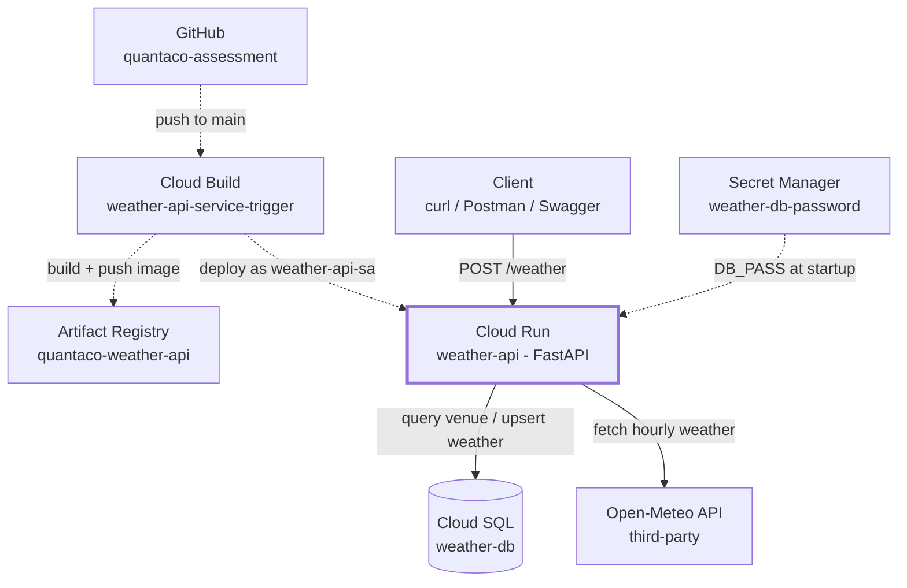

# Quantaco Weather API

Fetches hourly historical weather (Open-Meteo) for a venue over a date range and
saves it into Postgres. See `POST /weather` below.

## Live demo

Deployed on Cloud Run: **https://weather-api-71027124069.us-central1.run.app**

No setup needed to test it — it's a public endpoint. Interactive docs (Swagger UI):
https://weather-api-71027124069.us-central1.run.app/docs

```bash
curl -X POST https://weather-api-71027124069.us-central1.run.app/weather \
  -H "Content-Type: application/json" \
  -d '{"venue_id": 1, "start_date": "2024-01-01", "end_date": "2024-01-07"}'
```

The sections below cover running it locally instead, if preferred.

## Architecture

Two independent paths through the same Cloud Run service: a deploy triggered by a git
push (dashed), and a live API request (solid). They share only the running container
and its `weather-api-sa` identity.



- **Runtime**: Cloud Run (containerized FastAPI, sync)
- **Database**: Cloud SQL for PostgreSQL, raw SQL via `psycopg2` (no ORM)
- **DB connectivity**: no client library needed — Cloud Run's built-in
  `--add-cloudsql-instances` flag mounts a Unix socket to the instance in
  production; locally, the [Cloud SQL Auth Proxy](https://cloud.google.com/sql/docs/postgres/sql-proxy)
  opens the same kind of tunnel over a local TCP port. Same `psycopg2.connect(...)`
  call either way — see `database.py`.
- **CI/CD**: Cloud Build, triggered from this GitHub repo

## Prerequisites

- Python 3.11+
- A Cloud SQL for PostgreSQL instance (see "GCP setup" below)
- The [Cloud SQL Auth Proxy](https://cloud.google.com/sql/docs/postgres/connect-auth-proxy#install) binary, for local testing only
- A GCP service account with the **Cloud SQL Client** role, JSON key downloaded
  (Console: IAM & Admin → Service Accounts → Create → grant role → Keys → Add Key)

## Local setup & testing

1. **Create a virtualenv and install dependencies**
   ```bash
   python -m venv .venv
   source .venv/Scripts/activate   # Windows Git Bash; use .venv\Scripts\Activate.ps1 in PowerShell
   pip install -r requirements.txt
   ```

2. **Configure environment**
   ```bash
   cp .env.example .env
   ```
   Fill in `DB_USER`, `DB_PASS`, `DB_NAME` to match what you set up on the Cloud SQL
   instance, and `INSTANCE_CONNECTION_NAME` (format `PROJECT_ID:REGION:INSTANCE_NAME`,
   shown on the instance's Overview page in the Console).

3. **Start the Cloud SQL Auth Proxy** (separate terminal, keep it running)
   ```bash
   ./cloud-sql-proxy --credentials-file=key.json --port 5432 PROJECT_ID:REGION:INSTANCE_NAME
   ```
   This opens `127.0.0.1:5432`, tunneled to your real Cloud SQL instance.

4. **Apply the schema + seed data** (one-time, or after schema changes)
   ```bash
   python sql/apply_schema.py
   ```

5. **Run the API**
   ```bash
   uvicorn main:app --reload --port 8000
   ```

6. **Test it**

   Success case:
   ```bash
   curl -X POST http://localhost:8000/weather \
     -H "Content-Type: application/json" \
     -d '{"venue_id": 1, "start_date": "2024-01-01", "end_date": "2024-01-07"}'
   ```
   Expected: `200` with `{"status": "success", "records_saved": 168, ...}`

   Verify saved rows directly in the database (e.g. via Cloud SQL Studio or `psql`):
   ```sql
   SELECT * FROM weather WHERE venue_id = 1 ORDER BY datetime LIMIT 5;
   ```

   Error cases:
   ```bash
   # Unknown venue -> 404 VENUE_NOT_FOUND
   curl -X POST http://localhost:8000/weather -H "Content-Type: application/json" \
     -d '{"venue_id": 99, "start_date": "2024-01-01", "end_date": "2024-01-07"}'

   # start_date after end_date -> 400 INVALID_DATE_RANGE
   curl -X POST http://localhost:8000/weather -H "Content-Type: application/json" \
     -d '{"venue_id": 1, "start_date": "2024-01-07", "end_date": "2024-01-01"}'

   # Missing field -> 422 VALIDATION_ERROR
   curl -X POST http://localhost:8000/weather -H "Content-Type: application/json" \
     -d '{"venue_id": 1, "start_date": "2024-01-01"}'
   ```

   Or import the OpenAPI spec (auto-generated at `http://localhost:8000/openapi.json`,
   interactive docs at `http://localhost:8000/docs`) into Postman directly.

## GCP setup

All provisioned via the Console (no `gcloud` CLI used):

| Resource | Value |
|---|---|
| Project | `primeval-span-307214` |
| Region | `us-central1` |
| Cloud SQL instance | `weather-db` (PostgreSQL) — connection name `primeval-span-307214:us-central1:weather-db` |
| Database | `quantaco-weather-db` |
| DB user | `testuser` |
| Service account | `weather-api-sa` — roles: Cloud SQL Client, Cloud Run Admin, Artifact Registry Writer, Secret Manager Secret Accessor, Service Account User (on itself). Used as both the Cloud Build execution identity and the Cloud Run runtime identity. |
| Secret Manager | `weather-db-password` — the DB password, referenced by Cloud Run at runtime via `--set-secrets`, never in code or env vars |
| Artifact Registry | `quantaco-weather-api` (Docker repo) — holds built images |
| Cloud Run service | `weather-api` — public (`--allow-unauthenticated`), connected to Cloud SQL via `--add-cloudsql-instances` (Unix socket, no Auth Proxy needed in production) |
| Cloud Build trigger | `weather-api-service-trigger` — 1st-gen GitHub App connection to this repo, push to `main`, runs `assessment1/cloudbuild.yaml` |

Pipeline: a push to `main` → Cloud Build builds the Docker image from `assessment1/Dockerfile`
→ pushes it to Artifact Registry → deploys it to Cloud Run, all defined in `cloudbuild.yaml`.

## OpenAPI spec

`openapi.json` is the exported spec (OpenAPI 3.1, FastAPI's native output). Regenerate it
after any API change with:
```bash
python export_openapi.py
```
It's also always available live at `/openapi.json` on either the local server or the
deployed URL above, and as interactive docs at `/docs`.

## SQL QA checks

`sql/qa_checks.sql` audits the `weather` table on the dimensions/metrics that actually
matter to a frontend consuming it. Run it via Cloud SQL Studio (or `psql`) — each `SELECT`
returns the rows violating one check, so an empty result set means that check passes.
Verified against the live Cloud SQL instance: **0 rows returned**, all checks pass.

| Check | What | Why |
|---|---|---|
| `relative_humidity_2m` range | Must be 0–100 (or null) | Relative humidity is a percentage by definition (ratio of actual to saturation vapor pressure) — any value outside 0–100 is physically meaningless, regardless of data source |
| `precipitation_probability` range | Must be 0–100 (or null) | Same reasoning — it's documented as a percentage. Null is allowed |
| `precipitation` / `rain` / `showers` / `snowfall` / `snow_depth` non-negative | Must be ≥ 0 (or null) | These are physical quantities (mm of water/snow) — a negative amount is meaningless |
| Cross-field consistency | `precipitation ≈ rain + showers + snowfall / 7` | Precipitation is defined as *"rain + showers + snow"*. The `/7` matters: per Open-Meteo's docs, `snowfall` is in **cm** while `precipitation`/`rain`/`showers` are in **mm** — dividing by 7 converts snowfall to its water-equivalent in mm before summing. Missing this unit mismatch would make the check fail on every hour with real snowfall |
| No duplicate `(venue_id, datetime)` | Each hour, once per venue | Already enforced by the `UNIQUE(venue_id, datetime)` constraint (which is also what makes the upsert idempotent) — this check reproves it independently in SQL rather than only trusting the constraint blindly |
| No orphaned `venue_id` | Every `weather.venue_id` must exist in `venue` | Already enforced by the `FOREIGN KEY` constraint — same reasoning|


## Running with Docker

```bash
docker build -t quantaco-weather-api .
docker run --env-file .env -p 8080:8080 quantaco-weather-api
```
(Requires the Auth Proxy reachable from inside the container — for local Docker
testing, run the proxy with `--address 0.0.0.0` and point `DB_HOST` at your host
machine's address, e.g. `host.docker.internal` on Windows/Mac.)
