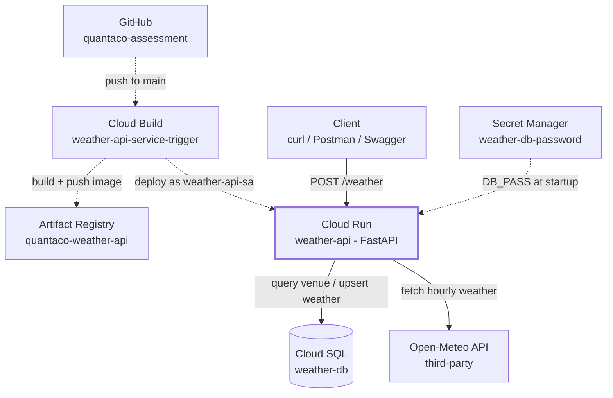

# Quantaco Weather API

Fetches hourly historical weather (Open-Meteo) for a venue over a date range and
saves it into Postgres.

## Live Demo

Deployed on Cloud Run: **https://weather-api-71027124069.us-central1.run.app**

No setup needed to test it - it's a public endpoint. Can directly test through Interactive docs (Swagger UI):
https://weather-api-71027124069.us-central1.run.app/docs

Send a request to the `\weather` endpoint to test the flow.
```cmd
curl -X POST https://weather-api-71027124069.us-central1.run.app/weather -H "Content-Type: application/json" -d "{\"venue_id\": 1, \"start_date\": \"2024-01-01\", \"end_date\": \"2024-01-07\"}"
```

## Architecture

Two independent paths through the same Cloud Run service: a deploy triggered by a git
push (dashed), and a live API request (solid). They share only the running container
and its `weather-api-sa` identity.



- **Runtime**: Cloud Run (containerized FastAPI, sync)
- **Database**: Cloud SQL for PostgreSQL, raw SQL via `psycopg2` (no ORM)
- **DB connectivity**: no client library needed - Cloud Run's built-in
  `-add-cloudsql-instances` flag mounts a Unix socket to the instance.
- **CI/CD**: Cloud Build, triggered from this GitHub repo

## Prerequisites

- Python 3.11+
- Docker (or any local PostgreSQL instance), for local development only -
  not needed to test the live deployment above

## Folder structure

```
assessment1/
├── main.py               # FastAPI app, exception handlers
├── schemas.py             # Pydantic request/response models, AppError
├── database.py            # databse connection
├── crud.py                # get_venue, upsert_weather_records
├── routers/
│   └── weather.py         # POST /weather route
├── integrations/
│   └── open_meteo.py      # Open-Meteo API client
├── sql/
│   ├── schema.sql         # venue + weather tables
│   ├── seed.sql           # sample venue rows
│   ├── qa_checks.sql      # data quality audit queries
│   └── apply_schema.py    # runs schema.sql + seed.sql against DB_* env
├── export_openapi.py      # exports the live OpenAPI spec to openapi.json
├── openapi.json           # exported spec 
├── Dockerfile
├── cloudbuild.yaml        # Cloud Build: build -> push -> deploy to Cloud Run
├── requirements.txt
└── .env.example
```

## Local development

This is only for development and local testing, using a disposable local Postgres instead of the real Cloud SQL instance. For live testing, refer `Live Demo` section above.

1. **Create a virtualenv and install dependencies**
   ```cmd
   python -m venv .venv
   .venv\Scripts\activate
   pip install -r requirements.txt
   ```

2. **Start Docker Desktop** (if using the Docker option below - skip if you already
   have a local Postgres running some other way)

3. **Start a local Postgres** (any local instance works; example via Docker)
   ```cmd
   docker run -d --name weather-pg -e POSTGRES_USER=weather_app -e POSTGRES_PASSWORD=localtest -e POSTGRES_DB=quantaco_weather -p 5432:5432 postgres:16
   ```

4. **Configure environment**
   ```cmd
   copy .env.example .env
   ```
   Fill in `DB_USER`, `DB_PASS`, `DB_NAME` to match the local instance above
   (`DB_HOST=127.0.0.1`, `DB_PORT=5432` by default).

5. **Apply the schema + seed data** (one-time, or after schema changes)
   ```cmd
   python sql/apply_schema.py
   ```

6. **Run the API**
   ```cmd
   uvicorn main:app --reload --port 8000
   ```

7. **Test it**

   Success case:
   ```cmd
   curl -X POST http://localhost:8000/weather -H "Content-Type: application/json" -d "{\"venue_id\": 1, \"start_date\": \"2024-01-01\", \"end_date\": \"2024-01-07\"}"
   ```
   Expected: `200` with `{"status": "success", "records_saved": 168, ...}`

   Verify saved rows directly in the database (e.g. via Cloud SQL Studio or `psql`):
   ```sql
   SELECT * FROM weather WHERE venue_id = 1 ORDER BY datetime LIMIT 5;
   ```

   Error cases:
   ```cmd
   :: Unknown venue -> 404 VENUE_NOT_FOUND
   curl -X POST http://localhost:8000/weather -H "Content-Type: application/json" -d "{\"venue_id\": 99, \"start_date\": \"2024-01-01\", \"end_date\": \"2024-01-07\"}"

   :: start_date after end_date -> 400 INVALID_DATE_RANGE
   curl -X POST http://localhost:8000/weather -H "Content-Type: application/json" -d "{\"venue_id\": 1, \"start_date\": \"2024-01-07\", \"end_date\": \"2024-01-01\"}"

   :: Missing field -> 422 VALIDATION_ERROR
   curl -X POST http://localhost:8000/weather -H "Content-Type: application/json" -d "{\"venue_id\": 1, \"start_date\": \"2024-01-01\"}"
   ```

   Or import the OpenAPI spec (auto-generated at `http://localhost:8000/openapi.json`,
   interactive docs at `http://localhost:8000/docs`) into Postman directly.

## GCP setup

All provisioned via the Console:

| Resource | Value |
|---|---|
| Project | `primeval-span-307214` |
| Region | `us-central1` |
| Cloud SQL instance | `weather-db` (PostgreSQL) -- connection name `primeval-span-307214:us-central1:weather-db` |
| Database | `quantaco-weather-db` |
| DB user | `testuser` |
| Service account | `weather-api-sa` - roles: Cloud SQL Client, Cloud Run Admin, Artifact Registry Writer, Secret Manager Secret Accessor, Service Account User (on itself). Used as both the Cloud Build execution identity and the Cloud Run runtime identity. |
| Secret Manager | `weather-db-password` - the DB password, referenced by Cloud Run at runtime via `--set-secrets`, never in code or env vars |
| Artifact Registry | `quantaco-weather-api` (Docker repo) - holds built images |
| Cloud Run service | `weather-api` - public (`--allow-unauthenticated`), connected to Cloud SQL via `--add-cloudsql-instances` (Unix socket, no Auth Proxy needed in production) |
| Cloud Build trigger | `weather-api-service-trigger` - GitHub App connection to this repo, push to `main`, runs `assessment1/cloudbuild.yaml` |

Pipeline: a push to `main` → Cloud Build builds the Docker image from `assessment1/Dockerfile`
→ pushes it to Artifact Registry → deploys it to Cloud Run, all defined in `cloudbuild.yaml`.

## OpenAPI spec

`openapi.json` is the exported spec (OpenAPI 3.1, FastAPI's native output). Regenerate it
after any API change with:
```cmd
python export_openapi.py
```
It's also always available live at `/openapi.json` on either the local server or the
deployed URL above, and as interactive docs at `/docs`.

## SQL QA checks

`sql/qa_checks.sql` audits the `weather` table on the dimensions/metrics that actually
matter to a frontend consuming it. Run it via Cloud SQL Studio (or `psql`) - each `SELECT`
returns the rows violating one check, so an empty result set means that check passes.
Verified against the live Cloud SQL instance: **0 rows returned**, all checks pass.

| Check | What | Why |
|---|---|---|
| `relative_humidity_2m` range | Must be 0–100 (or null) | Relative humidity is a percentage by definition - any value outside 0–100 is physically meaningless |
| `precipitation_probability` range | Must be 0–100 (or null) | Same reasoning - it's documented as a percentage. Null is allowed |
| `precipitation` / `rain` / `showers` / `snowfall` / `snow_depth` non-negative | Must be ≥ 0 (or null) | These are physical quantities (mm of water/snow) - a negative amount is meaningless |
| Cross-field consistency | `precipitation ≈ rain + showers + snowfall / 7` | Precipitation is defined as *"rain + showers + snow"*. The `/7` matters: per Open-Meteo's docs, `snowfall` is in **cm** while `precipitation`/`rain`/`showers` are in **mm** - dividing by 7 converts snowfall to its water-equivalent in mm before summing. Missing this unit mismatch would make the check fail on every hour with real snowfall |
| No duplicate `(venue_id, datetime)` | Each hour, once per venue | Already enforced by the `UNIQUE(venue_id, datetime)` constraint (which is also what makes the upsert idempotent) - this check just reproves it independently in SQL |
| `venue_id` | Every `weather.venue_id` must exist in `venue` | Already enforced by the `FOREIGN KEY` constraint|

